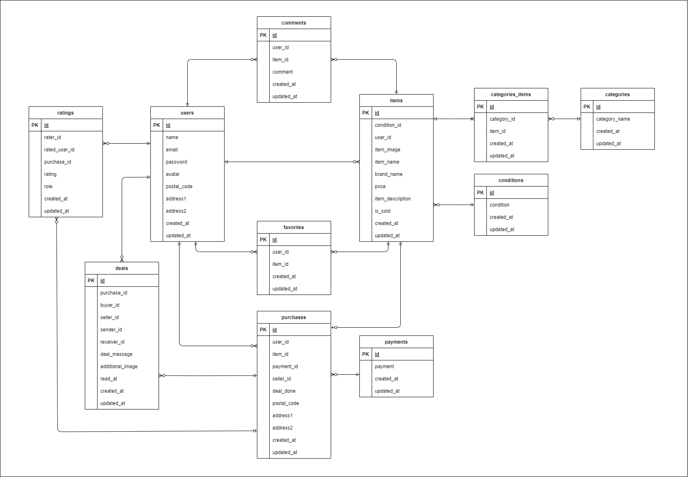

# coachtech フリマ

フリーマーケットアプリ

## 環境構築

### git をクローン

`git clone git@github.com:klaboworks/coachtech_freemarket.git` 
※アプリケーションのルートディレクトリへ移動してください

### Docker ビルド/PHP コンテナログイン

`docker-compose up -d --build` 
`docker-compose exec php bash`

### パッケージをインストール

`composer install`

## 環境変数設定

### .env ファイルを作成

`cp .env.example .env`

### MAILER 送信設定

本アプリケーションは Mailtrap を想定したメール送信機能を実装しています。
.env ファイルの MAIL の項目を適切な設定に更新してください。

### .env ファイのル LOCAL 項目を下記に変更

    APP_LOCALE=ja
    APP_FALLBACK_LOCALE=ja
    APP_FAKER_LOCALE=ja_JP

### .env ファイのル DB 項目を下記に変更

    DB_CONNECTION=mysql
    DB_HOST=mysql
    DB_PORT=3306
    DB_DATABASE=laravel_db
    DB_USERNAME=laravel_user
    DB_PASSWORD=laravel_pass

### .env ファイルに下記の項目を追加

    STRIPE_KEY= ここにストライプの公開鍵を入力してください
    STRIPE_SECRET= ここにストライプの秘密鍵を入力してください

### キーを作成

`php artisan key:generate`

### マイグレーション+データシーディング

`php artisan migrate --seed`

### アップロード画像表示機能オン

`php artisan storage:link`

## 実行環境

言語：PHP 8.3.12 
フレームワーク：Laravel 11.40.0 
データベース：MySQL

## ER 図

## URL

開発環境：http://localhost/

## テスト環境整備

### テスト用データベース作成

- Mysql コンテナにログイン
- 'test_db'という名前のデータベースを作る
- 下記のコードで権限付与と権限の変更を MySQL サーバーに反映
- `GRANT ALL PRIVILEGES ON test_db.* TO 'laravel_user'@'%';`
- `FLUSH PRIVILEGES;`

### Laravel dusk の設定

- .env ファイルをコピーするなどして.env.dusk.local ファイルを生成
- DB_DATABASE の項目を'DB_DATABASE=test_db'に上書き

## 備考

- Laravel11 使用のため認証系のバリデーションは FormRequest 不使用
- Stripe のキーを設定していないと、テストがエラーになりますので、必ず設定してください
